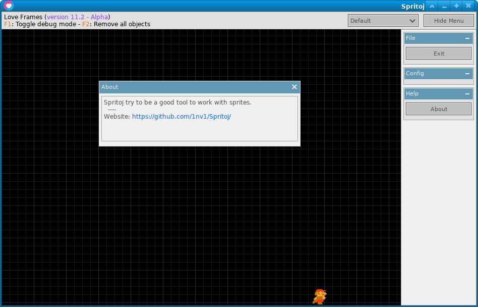

# Spritoj

## Information

Tool to work with sprites.

## Development goals

- [ ] I will try to test the advances in win10
- [ ] Build dialog system
- [ ] Create open-file dialog
- [ ] Create saveas-file dialog
- [ ] Define Spritoj format, possibly JSON
- [ ] Class to save data to PNG
- [ ] Pixel draw action
- [ ] It'self tool generated icon

## Diaries

I will try update the goals reached in [youtube](https://www.youtube.com/watch?v=T1GBcbxeEOA&list=PLiGrjBX7WMJAWx6LdNlucsiGI7pX2c7Pg)
## License

Spritoj is licensed under the zlib/libpng license. For more information, please read license.txt.

## Credits

Created by Nelson Lombardo

## Gui

LoveFrames - https://github.com/linux-man/LoveFrames

## Third-Party Libraries

i18n - https://github.com/kikito/i18n.lua

middleclass - https://github.com/kikito/middleclass

utf8.lua - https://github.com/Stepets/utf8.lua

tween.lua - https://github.com/kikito/tween.lua
